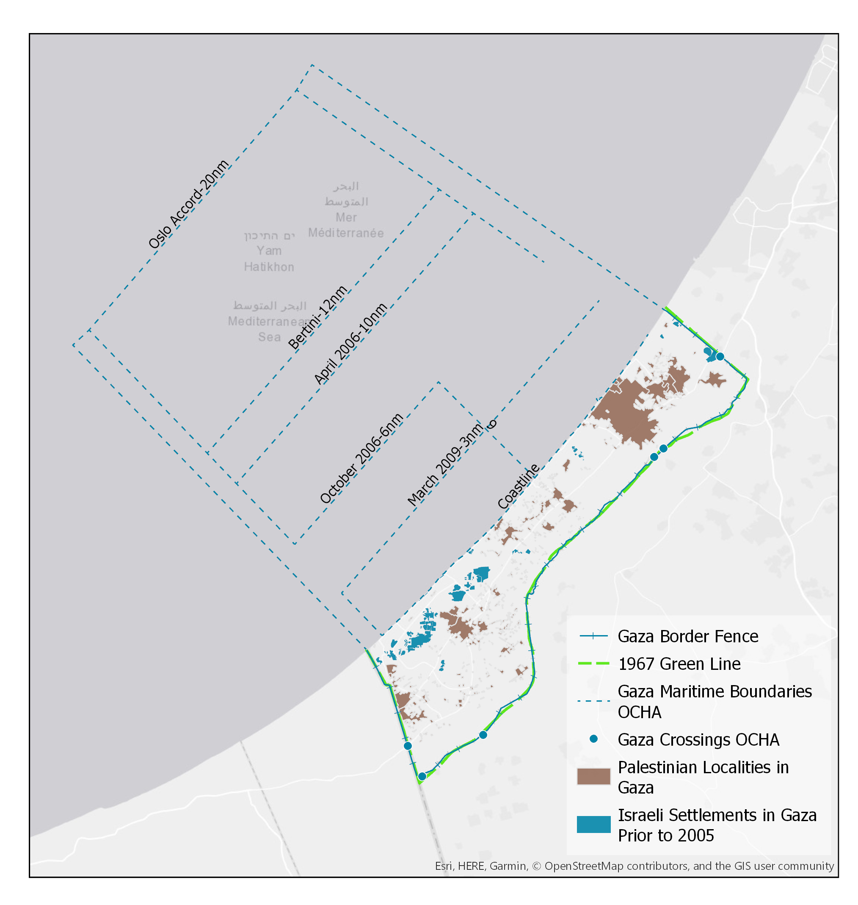

# Gaza Land Cover: Occupation as a Land Use

This project will expand upon the GEOG 699 course from last spring, “Occupation as a Land Use,” and the work done to study landscape changes in Gaza from 2000 to 2018. I will focus on the three main military operations imparted by Israel as well as effects of the blockade. To do so, I will look at a border buffer, abandoned Israeli settlements, and other landscape evidence of occupation. Because much of this work is done in Google Earth Engine, I will need to identify methods of importing this properly for web use. How Gaza is emphasized cartographically is important to this project and will be something that I will keep in mind while I design this story map.

<h3> Geospatial Data </h3>

Name | Description
------ | ------
Green Line | The internationally agreed upon border between Israel and Gaza.
Israeli Settlements within Gaza | The Israeli settlements prior to the August 2005 disengagement.
Border Fence | The actual location of the barrier fence or wall between Israel and Gaza. This does not follow the Green Line precisely.
Border Checkpoints | Locations of border checkpoints along the border between Israel and Gaza. Certain goods and people are restricted from passing through these checkpoints. Only two currently open.
Palestinian Localities | The built up area of Palestinian cities within Gaza.
Maritime Lines | The varying fishing and travel restrictions enforced by Israel for Gazans.
Classification Outputs | Land cover classification maps for Gaza from 2000 - 2018. Developed using a random forest classifier in Google Earth Engine.

 Map of Gaza 

<h3> Story Data </h3>

Title | URL
----- | ------
"Timeline: the humanitarian impact of the Gaza blockade" | https://www.oxfam.org/en/occupied-palestinian-territory-and-israel/timeline-humanitarian-impact-gaza-blockade
B'Tselem: The Israeli Information Center for Human Rights in the Occupied Territories | https://www.btselem.org/
"Disengagement, the Palestinian Economy, and the Settlements" | http://siteresources.worldbank.org/INTWESTBANKGAZA/Resources/psannexdiseng.pdf
"Twelve Powerful Images From the Gaza Disengagement" | https://www.haaretz.com/twelve-powerful-images-from-the-gaza-disengagement-1.5378980
